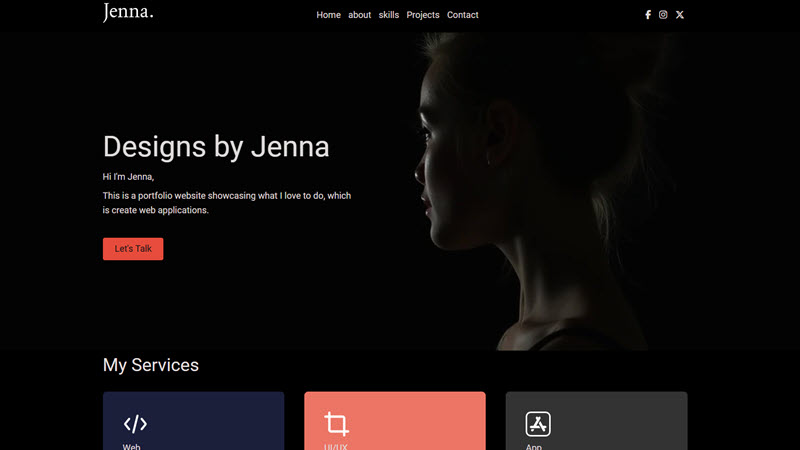

# Coding Challenges

## Content

This webpage was created as part of a Coding Diploma course with [Itonlinelearning](https://www.itonlinelearning.com/). It covers various coding challenges - challenges 1 - 11 of 13 - at the end of the HTML and CSS section of the course.

## The Brief

Below are the briefs for each challenge.

### Challenge 1

Challenge: Create a personal portfolio webpage showcasing your skills, projects, and contact information using HTML and CSS.

Requirements: Include a navigation menu, sections for About Me, Projects, Contact, and any other relevant information. Use CSS to style the layout and design.

### Challenge 2

Challenge: Develop a webpage that adapts to different screen sizes, ensuring it looks good on desktop, tablet, and mobile devices.

Requirements: Use media queries to adjust layout, font sizes, and other elements for various screen sizes. Test the responsiveness across different devices.

### Challenge 3

Challenge: Add animations to elements on a webpage using CSS.

Requirements: Create animations for hover effects, page transitions, or any other elements to enhance user interaction and visual appeal.

### Challenge 4

Challenge: Style HTML forms to make them visually appealing and user-friendly.

Requirements: Use CSS to customize form elements such as input fields, buttons, labels, and validation messages. Pay attention to layout, colors, and typography.

### Challenge 5

Challenge: Create a webpage layout using Flexbox or CSS Grid.

Requirements: Use Flexbox or CSS Grid to create a multi-column layout with responsive design. Experiment with different alignment, spacing, and distribution options.

### Challenge 6

Challenge: Focus on typography by styling headings, paragraphs, and other text elements.

Requirements: Experiment with different font families, sizes, weights, line heights, and spacing to create visually appealing text layouts.

### Challenge 7

Challenge: Build an image gallery webpage using HTML and CSS.

Requirements: Display multiple images in a grid layout with responsive design. Add hover effects or lightbox functionality for an interactive experience.

### Challenge 8

Challenge: Use a CSS framework like Bootstrap or Foundation to build a webpage.

Requirements: Explore the features of the chosen framework to create a responsive and visually appealing webpage. Customize the design as needed.

### Challenge 9

Challenge: Build a map page resembling Google Maps using HTML and CSS.

Requirements: Utilize the features of the selected CSS framework to develop a responsive and visually appealing map page. Customize the design to resemble the layout and functionality of Google Maps as closely as possible.

### Challenge 10

Challenge: Ensure your webpage is accessible to all users, including those with disabilities.

Requirements: Follow accessibility best practices such as using semantic HTML, providing alternative text for images, ensuring keyboard navigation, and testing with screen readers.

### Challenge 11

Challenge: Convert a provided PSD (Photoshop) file or image design into a fully functional HTML webpage.

Requirements: Pay attention to layout accuracy, typography, spacing, and visual fidelity. Use HTML and CSS to replicate the design as closely as possible while maintaining responsiveness.
